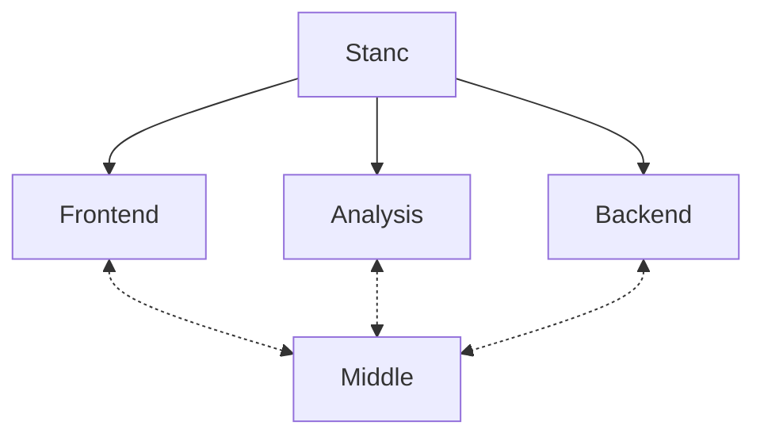
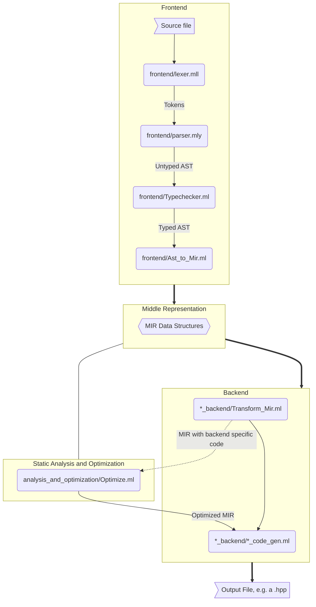

# A New Stan-to-C++ Compiler, stanc3
This repo contains a new compiler for Stan, stanc3, written in OCaml.
Since version 2.26, this has been the default compiler for Stan. See [this wiki](https://github.com/stan-dev/stanc3/wiki/changes-from-stanc2) for a list of minor differences between this compiler and the previous Stan compiler.

To read more about why we built this, see this [introductory blog post](https://statmodeling.stat.columbia.edu/2019/03/13/stanc3-rewriting-the-stan-compiler/). For some discussion as to how we chose OCaml, see [this accidental flamewar](https://discourse.mc-stan.org/t/choosing-the-new-stan-compilers-implementation-language/6203).
We're testing [these models](https://jenkins.flatironinstitute.org/job/Stan/job/Stanc3/job/master/) (listed under Test Results) on every pull request.

 

## Documentation

Documentation for users of stanc3 is in the Stan Users' Guide [here](https://mc-stan.org/docs/stan-users-guide/using-the-stan-compiler.html)

The Stanc3 Developer documentation is available here: https://mc-stan.org/stanc3/stanc

Want to contribute? See [Getting Started](https://mc-stan.org/stanc3/stanc/getting_started.html)
for setup instructions and some useful commands.

## High-level concepts, invariants, and 30,000-ft view
Stanc3 has 4 main src packages: `frontend`, `middle`, `analysis_and_optimization` and `stan_math_backend`.

The goal is to keep as many details about the way Stan is implemented by the core C++ implementation in the Stan Math backend library as possible.
The Middle library contains the MIR and currently any types or functions used by the two ends.
The entrypoint for the compiler is in `src/stanc/stanc.ml` which sequences the various components together.

### Distinct stanc Phases

The phases of stanc are summarized in the following information flowchart and list.

1. [Lex](src/frontend/lexer.mll) the Stan language into tokens.
1. [Parse](src/frontend/parser.mly) Stan language into AST that represents the syntax quite closely and aides in development of pretty-printers and linters. `stanc --debug-ast` to print this out.
1. Typecheck & add type information [Typechecker.ml](src/frontend/Typechecker.ml).  `stanc --debug-decorated-ast`
1. [Lower](src/frontend/Ast_to_Mir.ml) into [Middle Intermediate Representation](src/middle/Program.ml) (AST -> MIR) `stanc --debug-mir` (or `--debug-mir-pretty`)
1. Backend-specific MIR transform  (MIR -> MIR) [Transform_Mir.ml](src/stan_math_backend/Transform_Mir.ml)  `stanc --debug-transformed-mir`
1. Analyze & optimize (MIR -> MIR)
1. Code generation  (MIR -> [C++](src/stan_math_backend/Stan_math_code_gen.ml)) (or other outputs, like [Tensorflow](https://github.com/stan-dev/stan2tfp/)).

### The central data structures

1. `src/frontend/Ast.ml` defines the AST. The AST is intended to have a direct 1-1 mapping with the syntax, so there are things like parentheses being kept around.
The pretty-printer in the frontend uses the AST and attempts to keep user syntax the same while just adjusting whitespace.

    The AST uses a particular functional programming trick to add metadata to the AST (and its other tree types), sometimes called [the "two-level types" pattern](http://lambda-the-ultimate.org/node/4170#comment-63836). Essentially, many of the tree variant types are parameterized by something that ends up being a placeholder not for just metadata but for the recursive type including metadata, sometimes called the fixed point. So instead of recursively referencing `expression` you would instead reference type parameter `'e`, which will later be filled in with something like `type expr_with_meta = metadata expression`.

    The AST intends to keep very close to Stan-level semantics and syntax in every way.

2. `src/middle/Program.ml` contains the MIR (Middle Intermediate Language). `src/frontend/Ast_to_Mir.ml` performs the lowering and attempts to strip out as much Stan-specific semantics and syntax as possible, though this is still something of a work-in-progress.

    The MIR uses the same two-level types idea to add metadata, notably expression types and autodiff levels as well as locations on many things. The MIR is used as the output data type from the frontend and the input for dataflow analysis, optimization (which also outputs MIR), and code generation.

3. `src/stan_math_backend/Cpp.ml` defines a minimal representation of C++ used in code generation.

    This is intentionally simpler than both the above structures and than a true C++ AST and is tailored pretty specifically
    to the C++ generated in our model class.

## Design goals
* **Multiple phases** - each with human-readable intermediate representations for easy debugging and optimization design.
* **Optimizing** - takes advantage of info known at the Stan language level. Minimize information we must teach users for them to write performant code.
* **Holistic** - bring as much of the code as possible into the MIR for whole-program optimization.
* **Research platform** - enable a new class of optimizations based on probability theory.
* **Modular** - architect & build in a way that makes it easy to outsource things like symbolic differentiation to external libraries and to use parts of the compiler as the basis for other tools built around the Stan language.
* **Simplicity first** - When making a choice between correct simplicity and a perceived performance benefit, we want to make the choice for simplicity unless we can show significant (> 5%) benchmark improvements to compile times or run times. Premature optimization is the root of all evil.
